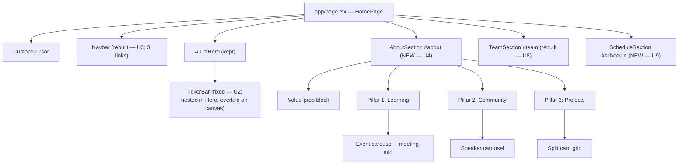
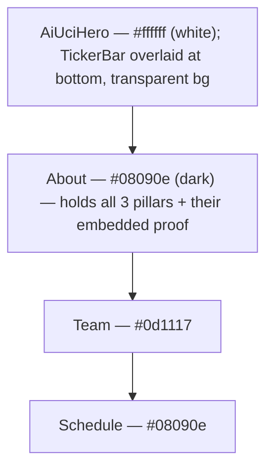
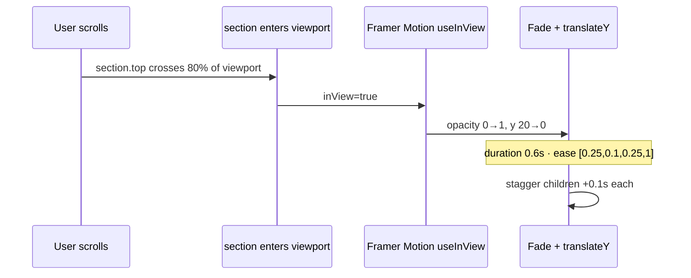

# feat: AI @ UCI Portfolio — Dark-Theme Buildout Plan

## Summary

Restructure the AI @ UCI portfolio (`~/ai-uci`) from its current half-built state into a complete dark-theme single-page site with **three** main sections: About (the heavy section, holding all three pillars with embedded proof), Team, and Schedule. The previously planned standalone Community, Learning, and Projects sections **collapse into About** — each pillar (Learning / Community / Projects) renders its proof content (event carousel / speaker carousel / project card grid) directly below its title-and-body row, alternating left/right. The standalone Sponsors section is dropped entirely; the hero ticker is the only sponsor surface. Reuses the existing hero canvas and ticker bar (with fixes), rebuilds the navbar in dark glass with three anchors (About · Team · Schedule). Board roster and event imagery pulled from `aiatuci/aiatuci.github.io@master`. Newsletter signup is a frontend-only stub.

---

## Problem Frame

The site exists as a Next.js 16.2.6 scaffold with a finished hero + ticker and stub section components imported into `app/page.tsx`. The origin engineering doc (`/Users/leo/Downloads/ai-uci-engineering-plan.md`) defined seven sections; subsequent user direction has restructured to **three sections** with proof content embedded under each pillar of About. This plan documents the consolidated structure: Navbar + Hero + Ticker + About (value-prop block + 3 pillars each with embedded carousels/cards) + Team + Schedule.

Decisions that supersede the origin doc:
- **KTD13 (new):** consolidate Community / Learning / Projects content INTO About's pillars as embedded proof. The standalone sections are cut.
- **KTD14 (new):** Sponsors live only in the hero ticker. The previously planned standalone SponsorsSection AND the nested sponsor strip at the bottom of About are both dropped.
- **KTD4 / KTD5 / KTD2** continue to apply: alternating-row pillars; PP Neue Montreal 500 titles; ticker fixes (transparent / hairline / 2× NVIDIA + Lovable).

This plan turns the consolidated structure into a buildable Implementation-Unit sequence. U5 (Community), U6 (Learning), U7 (Projects) are deleted as standalone units — their content folds into U4 (About).

---

## What Already Exists (Verified 2026-06-20)

- `app/page.tsx` — imports CustomCursor, Navbar, AiUciHero, CommunitySection, ProjectsSection, SpeakersSection, SponsorsSection, TeamSection
- `app/globals.css` — `@font-face` declared for Redaction50 (400 + 700) and PPNeueMontreal (Book 400 / Bold 700 / Italic 400); **Medium (500) is NOT installed**
- `public/fonts/` — Redaction 50 woff2 (400+700, italic+normal), PP Neue Montreal Book/Bold/Italic/Thin. Medium .otf missing
- `public/anteater-logo.png` — geometric anteater mark (kept; will be `filter: invert(1)` in navbar)
- `public/images/sponsors/` — claude/cactus/nvidia/lovable/supabase/sunstone/aws (already trimmed; WICS not present)
- `components/ui/ai-uci-hero.tsx` — done; white canvas, neural-net + logo image render, ticker mounted at bottom
- `components/ui/ticker-bar.tsx` — done structurally; needs hairline fix, transparent bg verify, NVIDIA + Lovable 2× sizing
- `components/ui/navbar.tsx` — exists but light-theme; needs full dark-glass rewrite + Schedule link
- `components/ui/custom-cursor.tsx` — kept
- `components/sections/community.tsx`, `projects.tsx`, `speakers.tsx`, `sponsors.tsx`, `team.tsx` — light-theme stubs; will be rebuilt or deleted

---

## Scope Boundaries

### In Scope
- Dark-theme rebuild of every non-hero section
- Three sections only: `AboutSection`, `TeamSection`, `ScheduleSection`
- About is the heavy section: value-prop block + 3 pillars, each pillar followed by its own embedded proof block:
  - Pillar 1 (Learning) → embedded auto-scrolling event/workshop carousel + meeting-info row
  - Pillar 2 (Community) → embedded arrow-navigated speaker carousel (empty-state when SPEAKERS array is empty — no fake placeholder speakers)
  - Pillar 3 (Projects) → embedded split-card grid (left: CACTUS + Winter Quarter; right: AWS CloudHacks 2026)
- DELETE standalone CommunitySection, LearningSection/SpeakersSection, ProjectsSection, SponsorsSection — content either moves into About or is dropped entirely
- DELETE the nested sponsor logo strip at bottom of About (planned in earlier revision) — ticker is the only sponsor surface
- Navbar rebuild for dark glass with three links only: About · Team · Schedule
- Ticker bar fixes: hairline removal, transparent bg, NVIDIA + Lovable 2× size
- Value-prop block at top of About: candid event photo left, team group photo right, heading + body copy ABOVE
- Three pillars as full-width alternating rows (icon + text alternating L/R), NOT card grid
- Pillar titles in PP Neue Montreal 500 (Medium)
- Board roster sourced from `aiatuci/aiatuci.github.io@master:/images/boards/` with styled placeholder for missing headshots and consent-gated ADVISORS/OFFICERS arrays
- Newsletter signup as frontend-only stub with honest success copy
- Mobile-responsive at 375 / 768 / 1024 / 1440 breakpoints

### Deferred to Follow-Up Work
- Real newsletter backend integration (MailChimp / Resend / Formspree)
- Dynamic event/officer content management (currently a typed array in source)
- Touch physics on carousels (drag inertia, swipe snap) — basic native scroll only for v1
- Active-nav-link highlighting via IntersectionObserver — defer to polish pass if it lands clean, otherwise punt
- Light-mode theme variant
- WICS sponsor logo — dropped from v1; revisit when asset is supplied

### Out of Scope
- Multi-page routing (single-page anchored scroll)
- Authentication or members-only content
- CMS integration
- Hero canvas color change (intentionally kept white)
- New visual design decisions beyond what the origin doc + supplemental user direction cover

---

## Key Technical Decisions

### KTD1: Hero stays white, all other sections dark
**Decision.** `AiUciHero` continues to paint `#ffffff`; every section under `<main>` uses `#08090e` or `#0d1117` alternating. A 120px linear-gradient fade from `#ffffff → transparent` is painted at the bottom of the hero canvas to soften the white→dark transition into the About section.
**Rationale.** The hero is the brand moment (neural net + particle anteater); isolating it in white sets it apart from the editorial dark site below. The gradient bridge prevents the seam from reading as a build defect at the cost of ~3 lines of canvas paint code.
**Implication.** Bridge paint happens in `ai-uci-hero.tsx` inside the existing animate() loop, AFTER the network and logo are drawn (so they aren't faded). Ticker bar still uses `transparent` bg over the hero; the bridge sits behind the ticker.

### KTD11: Color tokens with floating-point opacity rounded up to WCAG-AA-passing values
**Decision.** Secondary muted text (meeting info, IG label, sponsor eyebrows, card subtitles) uses `rgba(168, 196, 240, 0.8)` — NOT `0.6`. Body copy on dark stays at `rgba(240, 244, 255, 0.78)` or higher.
**Rationale.** `#a8c4f0 @ 0.6` on `#08090e` computes ~3.8:1 contrast — fails WCAG AA (4.5:1 minimum for normal text). Bumping to 0.8 lifts contrast above 5:1 while preserving the muted intent.
**Implication.** Affects Community meeting-info row, Schedule IG/meeting rows, sponsor eyebrows, all secondary card text. Apply token-wide in U1's color audit step.

### KTD13: Consolidate Community / Learning / Projects into About's pillars as embedded proof
**Decision.** No standalone CommunitySection, LearningSection (or SpeakersSection), or ProjectsSection. Each pillar of About renders its proof content directly below the pillar's title + body row:
- **Pillar 1 — Learning:** embedded auto-scrolling event/workshop carousel + meeting-info row
- **Pillar 2 — Community:** embedded arrow-navigated speaker carousel (empty-state copy when no speakers confirmed — NO placeholder TBD entries)
- **Pillar 3 — Projects:** embedded split-card grid (left col 5fr: CACTUS + Winter Quarter; right col 7fr: AWS CloudHacks 2026)
**Rationale.** Pillars are "claim + immediate proof" rather than abstract value statements. Embedding proof under each pillar collapses the scroll depth from ~5 sections to 1 dense section, keeping the user closer to Schedule (the CTA). Three sections total (About, Team, Schedule) keeps navbar clean.
**Implication.** About is the heavy section by far (~3-4 viewport-heights). The three pillars still alternate L/R layout (icon vs. copy column placement); the embedded proof block lives BELOW the pillar's two-column row, full-width up to the pillar's max-width. `components/sections/community.tsx`, `projects.tsx`, `speakers.tsx` are all DELETED in U4's PR (along with `sponsors.tsx`).

### KTD14: Sponsors live only in the hero ticker
**Decision.** No standalone SponsorsSection and no nested sponsor strip at the bottom of About. The hero ticker is the only sponsor surface on the site.
**Rationale.** The ticker is already the dominant sponsor moment — adding a second static strip duplicates the credibility signal at the cost of vertical real estate. Three navbar links (About · Team · Schedule) cleanly map to the visible page sections.
**Implication.** `components/sections/sponsors.tsx` is deleted. The 7-logo set (Claude, Cactus, NVIDIA, Lovable, Supabase, Sunstone, AWS) renders only in the ticker. WICS remains dropped.

### KTD12: SEO + Open Graph metadata in `app/layout.tsx`
**Decision.** `app/layout.tsx` exports a `metadata` object with `title`, `description`, and basic Open Graph + Twitter card tags pointing at a static OG card (or the anteater logo).
**Rationale.** The site is shared on Discord, IG DMs, LinkedIn — without OG tags it renders as an untitled blank card, undercutting every other launch effort. Adding it via Next 16 `metadata` export is ~12 lines, zero new deps, sits naturally inside U1.
**Implication.** Public OG asset path: `/og-card.png` (1200×630). If asset not on hand, fall back to `/anteater-logo.png` cropped/padded to 1200×630 — flag for follow-up but don't ship without ANY image (worse than no metadata).

### KTD2: Ticker bar — transparent bg + zero hairline
**Decision.** `components/ui/ticker-bar.tsx` outer container is `background: transparent`. All border-top/-bottom, margin-top, padding-top sources at the hero→ticker boundary are audited and removed. Body/main default margins reset to 0 in `globals.css`.
**Rationale.** Neural net must show through; any hairline reads as a layout bug.
**Implication.** Logo opacity may need to bump to 0.9 max for legibility against moving nodes — no per-logo backdrop or bg color.

### KTD3: All section entries via Framer Motion `useInView`, fade + translateY(20px→0)
**Decision.** Duration 0.6s, ease `[0.25, 0.1, 0.25, 1]`, children stagger 0.1s. **`useInView(ref, { once: true, amount: 0.3 })`** — fire one time when 30% of the section is visible; never re-fire on scroll-back. **Reduced motion:** `useReducedMotion()` short-circuits the animation entirely — when `true`, sections render in their final state with no fade/translate. CSS keyframes (`scroll-left`) also gate on `@media (prefers-reduced-motion: reduce) { animation-play-state: paused }`.
**Rationale.** Default Framer Motion `useInView` re-fires on every viewport entry, which would create a flicker on scroll-back. Site is single-page and users will scroll-up; `once: true` is the correct default. Reduced-motion handling is WCAG SC 2.3 hygiene for a CS/engineering audience that disproportionately enables it.
**Implication.** Carousel auto-scrolls (community, ticker) use CSS keyframes, not Framer Motion — they're continuous loops, not entry animations, but the reduced-motion `@media` block also pauses them.

### KTD4: Three pillars as full-width alternating rows, not a card grid
**Decision.** Each pillar gets its own row, ~96px vertical padding between rows, icon on one side and copy on the other, alternating L/R. No card containers.
**Rationale.** Editorial, less generic; gives each pillar its own visual breathing room. Supersedes the origin doc's "three pillar cards in a column row" framing.
**Implication.** Pillars are visually heavier (taller section). Mobile collapses to single-column stacked icon-above-text.

### KTD5: Pillar titles in PP Neue Montreal 500 (Medium)
**Decision.** Pillar titles use `font-family: PPNeueMontreal; font-weight: 500;`. Redaction 50 stays reserved for section-level headings only.
**Rationale.** The user explicitly directed this. Redaction 50 is the brand display face; reusing it for sub-headings dilutes its impact. PP Neue Montreal 500 gives pillar titles weight without competing.
**Implication.** PP Neue Montreal Medium .otf must be added to `public/fonts/` and declared in `globals.css`. If the asset is not on hand, the browser will fall back to the Book (400) face for `font-weight: 500` per the CSS Fonts L4 nearest-weight rule — there is no synthetic boldening. The pillar title will visually equal the body copy weight, which collapses the entire KTD5 rationale ("PP Neue Montreal 500 gives pillar titles weight without competing"). Either source the .otf before U1, OR fall back to Bold (700) at a smaller size as an honest interim. Do NOT ship the Book-fallback path — it produces a third typographic option nobody chose.

### KTD6: Newsletter signup is frontend-only stub with honest success copy
**Decision.** Email input + Subscribe button render and respond visually, but `onSubmit` calls `e.preventDefault()`, no POST is made, and the success message is explicitly honest about the stub state: **"Thanks — we'll have signups live soon. For now, follow @aiuci on Instagram or show up Wednesday at 4–5:30pm in DBH 6011."** The success state persists until the user navigates away (does NOT auto-revert after N seconds).
**Rationale.** Real backend wiring (MailChimp, Resend, Formspree) is out of scope for v1; the legacy site's MailChimp endpoint exists but reusing it commits list ownership without sign-off. The previous draft copy ("Thanks — we'll be in touch") is a dark pattern: nobody is in touch and the user believes they're subscribed. Honest copy redirects to the live touchpoints (IG + Wednesday meeting).
**Implication.** Stub is clearly commented in source so a follow-up engineer wires it in without re-discovery. Success state stays so users can't double-submit thinking the form failed.

### KTD7: ~~Sponsors nested at bottom of About~~ — SUPERSEDED BY KTD14
**Status.** This decision was reversed by KTD14 (sponsors live only in the hero ticker). The nested sponsor strip at the bottom of About is dropped. `components/sections/sponsors.tsx` is still deleted.

### KTD8: Board roster gated on current-leadership confirmation; legacy headshots are a reference, not a launch source
**Decision.** Launch ships TeamSection with **current** roster only. The hardcoded `OFFICERS` / `ADVISORS` arrays in `team.tsx` start with **styled placeholders for every entry** (monogram on `rgba(74,143,212,0.1)` bg). Headshots from `aiatuci/aiatuci.github.io@master:/images/boards/` are kept in `public/images/boards/` as a **reference set** but are only wired into the typed array AFTER current leadership confirms (a) the named individuals are current officers, (b) they consent to being shown on the new site. Missing-headshot fallback is the same styled placeholder.
**Rationale.** Source-repo roster reflects past officers. Shipping them as "current board" misrepresents their affiliation with the org — a consent issue independent of copyright. The `IMG_1129.jpg` entry has no name in source and would render a placeholder with an empty monogram. The honest path is to ship placeholder cards for the current officer count, fill in real names + photos as confirmation lands.
**Implication.** `team.tsx` exports a typed array that the implementer hand-edits as roster confirmations come in. Hardcoded REFERENCE roster (the 9+2 from `aiatuci.github.io@master`) lives in source as a commented-out block for context, NOT as the active render set. No filename parsing logic is written — every entry is hand-curated as a `{ name, role, image | null }` shape, and `image: null` triggers the placeholder.

### KTD9: Body bg dark + scroll-padding-top + cursor exception for form elements (globals.css)
**Decision.** `globals.css` adds three things in U1:
- `body { background: #08090e }` (replaces `#ffffff`); set `--background: #08090e` in `:root` so Tailwind v4 `@theme inline { --color-background: var(--background) }` resolves correctly.
- `html { scroll-padding-top: 80px }` — anchor jumps from the fixed 64px navbar land below it, not behind it.
- `input, textarea, button, a, select { cursor: auto !important }` (or `cursor: pointer` on clickable) — exempts form/interactive elements from the global `cursor: none !important` rule so the I-beam + pointer cursors return on inputs and interactive controls.
**Rationale.** All three are global-CSS-only hygiene that every section depends on. Bundling avoids forgetting any one.
**Implication.** `--background` change is observable via the Tailwind `bg-background` utility but no class currently uses it, so no regression. The cursor exception keeps the custom cursor on the rest of the page while restoring expected affordances on form fields.

### KTD10: Smooth-scroll via native `scrollIntoView`; active-link highlighting via IntersectionObserver in U3
**Decision.** Existing `scrollTo(href)` in `navbar.tsx` (`element.scrollIntoView({ behavior: 'smooth' })`) is kept. `html { scroll-padding-top: 80px }` (in KTD9) prevents the fixed navbar from clipping the anchor target. **Active-link highlighting promoted into U3:** an `IntersectionObserver` on each section sets `activeId` state; the matching navbar link gets `color: #4a8fd4`.
**Rationale.** Origin doc lists `Active: #4a8fd4` as a first-class navbar state alongside Hover. A single-page portfolio whose primary navigation is anchor-scroll needs a "where am I" signal. IntersectionObserver setup is ~15 lines and co-located with the navbar rewrite — cheapest moment to ship it.
**Implication.** Single `useState<string | null>` for `activeId`. Observer threshold `0.5` (section is "active" when 50%+ visible). No router dependency.

---

## High-Level Technical Design

### Component tree



### Dark/light boundary down the page



### Scroll-entry animation pattern (every section)



---

## Output Structure

```
ai-uci/
├─ app/
│  ├─ globals.css                 # PPNeueMontreal 500 @font-face; body bg → #08090e; scroll-padding-top 80; cursor exception for inputs/buttons/links; reduced-motion gate
│  ├─ layout.tsx                  # SEO + Open Graph metadata export
│  └─ page.tsx                    # 3-section composition: Navbar + Hero + Ticker + About + Team + Schedule
├─ components/
│  ├─ ui/
│  │  ├─ ai-uci-hero.tsx          # add 120px white→transparent gradient bridge at canvas bottom (KTD1); keep embedded <TickerBar /> render
│  │  ├─ custom-cursor.tsx        # untouched
│  │  ├─ navbar.tsx               # rewrite — dark glass + 3 links (About · Team · Schedule) + active-link IntersectionObserver + a11y
│  │  └─ ticker-bar.tsx           # transparent bg + hairline audit + NVIDIA/Lovable 2× sizing + SLOT_HEIGHT 72; stays absolute-positioned inside hero, overlaid on canvas
│  └─ sections/
│     ├─ about.tsx                # NEW — value-prop block + 3 pillars each with embedded proof block (event carousel / speaker carousel / project card grid). Largest file by far.
│     ├─ team.tsx                 # rewrite — current-roster-gated ADVISORS/OFFICERS arrays; placeholder fallback; legacy roster as commented-out reference
│     ├─ schedule.tsx             # NEW — honest stub newsletter copy + IG + meeting info
│     ├─ community.tsx            # DELETE — content folds into About pillar 1
│     ├─ projects.tsx             # DELETE — content folds into About pillar 3
│     ├─ speakers.tsx             # DELETE — content folds into About pillar 2
│     └─ sponsors.tsx             # DELETE — ticker is the only sponsor surface (KTD14)
└─ public/
   ├─ og-card.png                          # NEW asset — 1200×630 (fall back to anteater-logo)
   ├─ fonts/
   │  └─ PPNeueMontreal-Medium.otf      # NEW asset — see Risks
   └─ images/
      ├─ boards/                        # mirror aiatuci.github.io@master:/images/boards/
      │  ├─ Abhijot Kaler (Historian).jpg
      │  ├─ Amy Elsayed.JPG
      │  ├─ Eisah_Portrait.jpg
      │  ├─ Ihler.png
      │  ├─ IMG_1129.jpg
      │  ├─ Kausthub Raj Jadhav.jpg
      │  ├─ LATHROP.jpg
      │  ├─ Nikita Arivazhagan - Mentor.jpg
      │  ├─ Pooja Senthil Kumar _Secretary.JPG
      │  ├─ Shivan Vipani (Marketing Chair) .jpg
      │  └─ khoa.jpg
      └─ events/                        # mirror selected /images/*.jpg from source repo
         ├─ group.jpg                   # was DSC_0596.jpg (about value-prop right)
         ├─ candid.jpg                  # was walle.jpg or pic02.jpg (about value-prop left)
         └─ {pic01..pic09}.jpg          # community carousel deck
```

---

## Implementation Units

### U1. Fonts + globals.css + layout.tsx metadata groundwork

**Goal.** Land PP Neue Montreal Medium (500), switch body background + Tailwind background token to dark, add scroll-padding-top, exempt form/interactive elements from `cursor: none`, gate CSS animations on `prefers-reduced-motion`, add SEO + Open Graph metadata.

**Dependencies.** none. **Asset prereq:** PP Neue Montreal Medium .otf must be on hand before this unit starts. If not, fall back to Bold (700) at 28px for pillar titles (do NOT ship Book-as-500 — see KTD5).

**Files:**
- `public/fonts/PPNeueMontreal-Medium.otf` (NEW — see Risks/asset prereq above)
- `public/og-card.png` (NEW — 1200×630; fall back to `/anteater-logo.png` if not on hand)
- `app/globals.css`
- `app/layout.tsx`

**Approach.**
- `globals.css`:
  - Add `@font-face` block for PPNeueMontreal weight 500, mirroring the existing 400 + 700 blocks. If asset missing, skip this block and apply the Bold-700 fallback in U4 (see KTD5).
  - Change `:root { --background: #ffffff }` → `:root { --background: #08090e }` (set, don't remove — Tailwind v4 `@theme inline` consumes this token).
  - Change `body { background: #ffffff }` → `body { background: #08090e }`. Keep `min-h-full flex flex-col` class on body in `layout.tsx` untouched.
  - Add `html { scroll-padding-top: 80px }` so anchor jumps land below the fixed 64px navbar.
  - Add cursor exception below the existing `* { cursor: none !important }` rule:
    ```css
    @media (pointer: fine) {
      input, textarea, select, button, a, [role="button"] { cursor: auto !important; }
      button, a, [role="button"] { cursor: pointer !important; }
    }
    ```
  - Add reduced-motion gate:
    ```css
    @media (prefers-reduced-motion: reduce) {
      *, *::before, *::after { animation-play-state: paused !important; }
      .ticker-scroll-wrapper, .carousel-scroll-wrapper { animation: none !important; }
    }
    ```
  - Verify `html { scroll-behavior: smooth }` remains and `@keyframes scroll-left` is preserved.
- `app/layout.tsx`:
  - Export `metadata`:
    ```ts
    export const metadata = {
      title: 'Artificial Intelligence @ UCI',
      description: "Hands-on learning, real projects, and a community that builds together. Workshops, hackathons, and speakers at UC Irvine.",
      openGraph: {
        title: 'Artificial Intelligence @ UCI',
        description: '...',
        images: ['/og-card.png'],
        type: 'website',
      },
      twitter: { card: 'summary_large_image', images: ['/og-card.png'] },
    }
    ```

**Execution note.** Land first as a one-shot commit — every later unit depends on the font, dark bg, scroll-padding, cursor exception, and reduced-motion gate.

**Test scenarios.**
- A blank `<div>` with no inline style renders on `#08090e` in DevTools elements panel
- `getComputedStyle(document.body).backgroundColor === 'rgb(8, 9, 14)'`
- `getComputedStyle` on a `<p style="font-family: PPNeueMontreal; font-weight: 500">` resolves to the Medium file (Network tab confirms `PPNeueMontreal-Medium.otf` request)
- `getComputedStyle(document.documentElement).scrollPaddingTop` returns `80px`
- An `<input type="email">` rendered in DOM has `cursor: text` (or `auto`) on hover, NOT `none`
- A `<button>` has `cursor: pointer` on hover, NOT `none`
- Enabling "Reduce motion" in OS settings + reloading: ticker stops translating, carousel stops translating, no section fade-in animations
- View page source / inspect head: contains `<meta property="og:title" ...>` with the documented title
- `curl -sL localhost:3000 | grep og:image` returns the OG card path
- Hero canvas still paints white because `AiUciHero` sets its own bg
- Click any navbar anchor link still smooth-scrolls and lands BELOW the fixed navbar (not behind it)

**Verification.** Cold-load `localhost:3000` in private window. Use the Lighthouse SEO panel to confirm metadata pickup. Toggle Reduce Motion in macOS System Settings; reload; confirm ticker stops.

---

### U2. Ticker bar — transparent bg, hairline kill, NVIDIA + Lovable 2× size

**Goal.** Remove the gray hairline at the hero→ticker seam, confirm transparent bg passes through to the neural-net canvas, double NVIDIA + Lovable visual size.

**Dependencies.** U1

**Files:**
- `components/ui/ticker-bar.tsx`
- `components/ui/ai-uci-hero.tsx` (audit only — touch only if seam originates here)
- `app/globals.css` (audit `body`/`main` default margins)

**Approach.**
- **TickerBar stays nested inside AiUciHero.** No JSX move. The `<TickerBar />` render at the bottom of the hero container remains. TickerBar continues to be `position: absolute; bottom: 0`, overlaying the hero canvas so the neural-net animation renders behind the logos.
- Confirm `background: transparent` on the ticker outer container; remove any leftover `#ffffff`. With the ticker overlaid on the canvas, transparent reveals the neural net — this is the intended effect.
- Audit every CSS property that could create a 1px hairline at the bottom of the hero where the ticker sits: `border-top`, `border-bottom`, `box-shadow` with `inset 0 ±1px`, `margin-top`, `padding-top` on both `ticker-bar.tsx` and the hero container. Remove or zero out.
- **Delete legacy section borders.** `community.tsx`, `projects.tsx`, `speakers.tsx`, `sponsors.tsx`, `team.tsx` each have `borderTop: '1px solid rgba(0,0,0,0.06)'` on their root. The first four are deleted in U4's PR (per KTD13/KTD14), so the audit is moot for those. Only `team.tsx`'s legacy border needs to be removed when its rewrite ships in U8.
- In `ai-uci-hero.tsx`, add the 120px white-to-transparent gradient bridge at the bottom of the canvas paint (per KTD1): after the network + logo draw, paint a vertical gradient from `rgba(255,255,255,1)` at the canvas-bottom-minus-120 line to `rgba(255,255,255,0)` at the canvas bottom. The bridge sits behind the ticker (transparent) so the dark About section reads through as the canvas fades into the seam below the hero.
- In `globals.css`, confirm `body { margin: 0; padding: 0 }` is present and not overridden anywhere
- NVIDIA: change `h: 1.4` → `h: 2.0` in the `LOGOS` array (this is the per-logo height multiplier introduced in the current ticker file)
- Lovable: change `h: 1.35` → `h: 2.0`
- Grow `SLOT_HEIGHT` from 56 → 72 (required — `BASE_HEIGHT 32 × h 2.0 = 64px` exceeds the current 56px slot)
- Reverify mask gradient unchanged: `linear-gradient(to right, transparent 0%, #000 32%, #000 68%, transparent 100%)`
- Wrap the inner scroll track in a CSS class `ticker-scroll-wrapper` so the reduced-motion gate from U1 can target it.

**Test scenarios.**
- DOM inspection at the hero→ticker boundary: no element has a non-zero `border`, `box-shadow`, or `padding-top` that produces a visible line
- Visual: scrolling to the bottom of the hero, the hero canvas blends into the ticker with no visible line separator — the neural-net animation runs continuously up to and through the ticker logo area
- NVIDIA logo in the ticker is roughly 2× taller than before
- Lovable wordmark is roughly 2× taller than before
- Other logos (Claude, Cactus, Supabase, Sunstone, AWS) are visually unchanged
- Neural-net nodes and edges animate visibly behind the ticker logos
- Edge logos still fade to transparent via the mask gradient
- Animation loop is seamless (no jump at the `-50%` translate wrap)

**Verification.** Screenshot of the hero+ticker region — no visible separator line anywhere on the boundary, NVIDIA + Lovable rendered ~2× the height of their pre-change pixel size.

---

### U3. Navbar — dark glass rebuild (3 links)

**Goal.** Rewrite `components/ui/navbar.tsx` as a dark-glass nav with a white-inverted anteater logo, three allcaps PP Neue Montreal 500 links (About · Team · Schedule), and smooth-scroll to all section anchors. Active-link highlighting via IntersectionObserver on the three sections.

**Dependencies.** U1

**Files:**
- `components/ui/navbar.tsx`

**Approach.**
- **Remove** the existing scrollY-driven `useScroll`/`useTransform` morph logic (lines ~19–40 in the current `navbar.tsx`). Keep ONLY the initial slide-down entry on the outer `motion.nav`.
- Container: `position: fixed; top: 0; left: 0; right: 0; z-index: 50; height: 64px; padding: 0 32px`
- `background: rgba(255,255,255,0.06); backdrop-filter: blur(20px) saturate(180%); -webkit-backdrop-filter: same; border-bottom: 1px solid rgba(255,255,255,0.08); box-shadow: inset 0 1px 0 rgba(255,255,255,0.1)`
- Logo: ``
- Links container: `display: flex; gap: 28px; align-items: center`
- Each link: `<button>` with `font-family: PPNeueMontreal; font-weight: 500; font-size: 13px; letter-spacing: 0.08em; text-transform: uppercase; color: #f0f4ff; transition: color 150ms ease`
- **Labels in order (matches content render order):** `About` · `Team` · `Schedule`
- `onMouseEnter` → `color: #a8c4f0`; reset on leave
- **Active state:** when the corresponding section is ≥50% in the viewport (tracked via `IntersectionObserver`), link gets `color: #4a8fd4` and is `aria-current="location"`. Single `useState<string | null>` holds `activeId`.
- `onClick` → `document.querySelector(href)?.scrollIntoView({ behavior: 'smooth' })` (KTD9's `scroll-padding-top: 80px` makes anchors land below the bar)
- **`:focus-visible`** on each link: `outline: 2px solid #4a8fd4; outline-offset: 4px; border-radius: 2px`. Required because the global `cursor: none !important` removes the only other affordance for keyboard nav.
- **Mobile (`<769px`)**: replace link list with hamburger `<button aria-label="Menu" aria-expanded={open} aria-controls="mobile-menu">`; tapping reveals a `<div id="mobile-menu" role="dialog" aria-modal="true">` glass panel with the three links stacked. **Dismissal paths:** (a) tap a link → close + scroll, (b) tap the hamburger again → close, (c) press Escape → close (attach a `useEffect` keydown listener while open).
- Reuse existing `.hidden-mobile` / `.show-mobile` classes from `globals.css` for the breakpoint switch (those stay).
- Preserve the initial entry animation (slide-down 0.45s from `y: -16, opacity: 0`).

**Test scenarios.**
- Three links render in order: About, Team, Schedule
- Clicking each link smooth-scrolls AND the section's eyebrow/heading lands visibly below the 64px navbar (not behind it)
- Logo renders as white (inverted) over the glass
- At scroll = 0 the nav is glass (not opaque); at scroll = 600 still glass; the bar does NOT morph into a pill
- Hover on a link transitions color to `#a8c4f0` within ~150ms
- Scrolling past About: the About link gets `color: #4a8fd4`; scrolling further: the next-active link gets the color and About reverts
- Tab focus on a link shows the blue outline (focus-visible)
- Mobile (`<769px`): hamburger toggles the panel; tapping a link closes + scrolls; tapping the hamburger again closes; pressing Escape closes
- Hamburger button has `aria-expanded` matching open state
- No console error on smooth-scroll for any anchor (note: `#schedule` doesn't exist until U9 — U3 test scenarios that require Schedule click pass only after U9 lands)

**Verification.** Dev-server walk-through at 1440 and 375 widths; keyboard-only walkthrough using Tab + Enter + Escape.

---

### U4. About section — value-prop, alternating pillars, nested sponsor strip

**Goal.** Build `components/sections/about.tsx` containing the value-prop photo pair (candid left, group right), three full-width alternating-row pillars with PP Neue Montreal 500 titles, and a nested 7-logo sponsor strip at the bottom.

**Dependencies.** U1

**Files:**
- `components/sections/about.tsx` (NEW)
- `public/images/events/group.jpg` (mirrored from `aiatuci.github.io@master:/images/DSC_0596.jpg`)
- `public/images/events/candid.jpg` (mirrored from `aiatuci.github.io@master:/images/walle.jpg` or `pic02.jpg` — pick a candid)
- `public/images/sponsors/*` (already present; WICS not included)
- DELETE `components/sections/sponsors.tsx` (covered in U10)

**Files:**
- `components/sections/about.tsx` (NEW — largest file in the rewrite; holds value-prop + 3 pillars + 3 embedded proof blocks)
- `public/images/events/group.jpg` (mirrored from `aiatuci.github.io@master:/images/DSC_0596.jpg`)
- `public/images/events/candid.jpg` (mirrored from `aiatuci.github.io@master:/images/walle.jpg`)
- `public/images/events/{walle,hope,light,lightnight,wires,pic01..09}.jpg` (mirrored event deck for Pillar 1 carousel)
- `public/images/sponsors/cactus.png`, `aws.png` (already present; reused in Pillar 3 cards)
- **DELETE `components/sections/community.tsx`** (folded into Pillar 1)
- **DELETE `components/sections/speakers.tsx`** (folded into Pillar 2)
- **DELETE `components/sections/projects.tsx`** (folded into Pillar 3)
- **DELETE `components/sections/sponsors.tsx`** (ticker is the only sponsor surface per KTD14)
- `app/page.tsx` (add `import AboutSection`; remove imports for Community / Projects / Speakers / Sponsors)

**Approach.**
- `<section id="about" style={{ background: '#08090e', padding: '96px 32px' }}>` (note: 96px not 128px — see KTD11 height-trim guidance)
- **Value-prop block** (top): heading + copy ABOVE the photo pair (committed)
  - Eyebrow `WHAT WE DO` — `font-family: PPNeueMontreal; font-weight: 500; font-size: 11px; letter-spacing: 0.32em; color: #4a8fd4; text-transform: uppercase`
  - Heading: `font-family: Redaction50; font-size: clamp(36px, 5vw, 56px); line-height: 1.1; color: #f0f4ff; max-width: 900px`
    - Copy: "We don't just study AI. We build it, ship it, and grow together doing it."
  - Two-column grid (50/50) below the heading: candid event photo LEFT (`/images/events/candid.jpg`), team group photo RIGHT (`/images/events/group.jpg`). Each: 16:10 aspect, `object-fit: cover`, `border-radius: 8px`.
  - **Alt text:** `alt="AI @ UCI members at a workshop"` for candid; `alt="AI @ UCI officer team group photo"` for group. Descriptive, not filename.
  - Mobile (`<769px`): photos stack candid-above-group.
  - **Intermediate breakpoint (769–1023px):** photos stay 50/50 but the heading drops to ~36px and the value-prop block doesn't span full container width — heading + photos render in a single max-width-700 column to avoid the squeeze.
- **Three pillars with embedded proof** (below value-prop, ~96px gap):
  - Each pillar block = a **pillar row** (icon + copy in alternating two-column layout) + an **embedded proof block** directly below it (full-width up to max-width 1200px, mx-auto).
  - Pillar row: `display: grid; grid-template-columns: 1fr 1fr; align-items: center; gap: 64px; padding: 64px 0`
  - Pillar icon column: inline SVG (~120px square) with `stroke: #4a8fd4` and a soft drop-shadow glow
  - **Named icon concepts (NOT generic SaaS metaphors):**
    1. **Learning** — stacked terminal lines / code blocks suggesting hands-on workshops (NOT a graduation cap or book)
    2. **Community** — connected nodes / mini-network graph echoing the hero canvas neural net (NOT generic people silhouettes)
    3. **Projects** — geometric building blocks stacking upward suggesting shipped work (NOT a folder or wrench)
  - Pillar copy column:
    - Title: `font-family: PPNeueMontreal; font-weight: 500; font-size: 32px; color: #f0f4ff` (**if PP Neue Montreal Medium .otf not available, fall back to `font-weight: 700; font-size: 28px;` per KTD5 — never `font-weight: 500` resolving against the Book file**)
    - Body: `font-family: PPNeueMontreal; font-weight: 400; font-size: 16px; line-height: 1.6; color: rgba(240,244,255,0.78); max-width: 480px`
  - Embedded proof block sits ~48px below the pillar row, max-width 1200px (or wider for full-bleed carousels).
  - ~96px gap between pillar blocks.
  - Intermediate breakpoint (769–1023px): icons reduce to 80px; copy max-width 360px; proof blocks scale proportionally.
  - Mobile (<769px): pillar row collapses to single column (icon above copy), proof block below.

#### Pillar 1 — Learning (icon LEFT, copy RIGHT)

- **Title:** Learning
- **Body:** "Hands-on workshops with the tools that ship products: Claude, Cursor, NVIDIA stacks, Supabase, AWS."
- **Embedded proof: auto-scrolling event/workshop carousel.**
  - Wrapper class `carousel-scroll-wrapper` (matches reduced-motion gate from U1).
  - Outer: `display: flex; width: max-content; animation: scroll-left 60s linear infinite`
  - Items × N + duplicate set for seamless loop (same pattern as ticker).
  - **EVENTS typed array** (defined at top of `about.tsx`): `const EVENTS: { src: string; alt: string; name: string; date: string }[]`. `alt` is a descriptive 1-line sentence per event (NOT filename). Implementer fills `alt` per-event as assets are wired.
  - Each card: `width: 360px; flex-shrink: 0; margin-right: 24px`
    - Photo: `height: 280px; width: 100%; object-fit: cover; border-radius: 8px; border: 1px solid rgba(255,255,255,0.05)`
    - Below photo: event name (PP Neue Montreal 14px, `#f0f4ff`) + date (PP Neue Montreal 12px, `rgba(168,196,240,0.8)`)
  - Hover: lift border to `1px solid rgba(74,143,212,0.4)`, transition 150ms; also pauses animation via `:hover { animation-play-state: paused }` on the outer wrapper.
  - Same `WebkitMaskImage` edge-fade gradient as the ticker so cards dissolve at screen edges.
- **Meeting-info row** below the carousel (~32px gap):
  - `display: flex; align-items: center; gap: 12px; justify-content: center`
  - Inline calendar SVG (16px, stroke `#a8c4f0`).
  - Text: "Join us every Wednesday at 4:00–5:30pm in DBH 6011 for general meetings and workshops!"
  - `font-family: PPNeueMontreal; font-size: 14px; color: rgba(168,196,240,0.8)`
  - Define `const MEETING_INFO_COPY = "..."` at module top so Schedule (U9) imports the same string.
- **Event source map** (mirror selected files from `aiatuci.github.io@master:/images/` into `public/images/events/`):

| Local path | Source repo path | Initial alt-text hint |
|---|---|---|
| `events/walle.jpg` | `images/walle.jpg` | WALL-E AI viewing event |
| `events/hope.jpg` | `images/hope.jpg` | Hope event |
| `events/light.jpg` | `images/light.jpg` | Light event |
| `events/lightnight.jpeg` | `images/lightnight.jpeg` | Evening event session |
| `events/wires.jpg` | `images/wires.jpg` | Wires workshop |
| `events/pic01..09.jpg` | `images/pic01..09.jpg` | General event photos |

#### Pillar 2 — Community (copy LEFT, icon RIGHT)

- **Title:** Community
- **Body:** "Speakers, hackathons, and weekly meetings where builders, researchers, and beginners meet."
- **Embedded proof: arrow-navigated speaker carousel.**
  - **SPEAKERS typed array** (defined at top of `about.tsx`): `const SPEAKERS: { img: string; name: string; company: string; role: string; alt: string }[]`
  - **Empty-state rule (load-bearing).** If `SPEAKERS.length === 0`, do NOT render the carousel. Render instead a single centered block:
    > "Speaker lineup coming soon — show up Wednesday to meet them in person."
    (PP Neue Montreal 16px, `rgba(240,244,255,0.78)`, max-width 480px, ~48px vertical padding)
    Do NOT ship placeholder TBD speakers (per ce-doc-review FINDING 2).
  - When ≥1 speaker confirmed:
    - State: `const [index, setIndex] = useState(0)`
    - Single card centered, fade-and-slide transition via Framer Motion `<AnimatePresence mode="wait">`
    - Card: `width: 480px; padding: 48px; background: rgba(255,255,255,0.02); border: 1px solid rgba(74,143,212,0.15); border-radius: 16px`
      - Headshot: circular, `width: 200px; height: 200px; object-fit: cover; border-radius: 50%`; `alt={speaker.alt}` (descriptive)
      - Name (Redaction 50 28px, `#f0f4ff`)
      - Company (PP Neue Montreal 14px, `#a8c4f0`)
      - Role (PP Neue Montreal 13px, `rgba(240,244,255,0.65)`)
    - When `SPEAKERS.length >= 2`: left/right arrow `<button aria-label="Previous speaker" / "Next speaker">` flanking the card, outline circle 48px, hover/focus blue. Arrow handlers wrap with modulo. **No section-level keydown handler** — arrow buttons are tab-focusable + native Enter/Space activation.
    - When `SPEAKERS.length === 1`: render the card WITHOUT arrows.
    - `useReducedMotion()` short-circuits the slide transition.

#### Pillar 3 — Projects (icon LEFT, copy RIGHT)

- **Title:** Projects
- **Body:** "CACTUS, the Winter Quarter Project, and AWS CloudHacks 2026 — real builds, real shipped impact."
- **Embedded proof: split card grid.**
  - Layout: `display: grid; grid-template-columns: 5fr 7fr; gap: 24px; max-width: 1200px; mx-auto`
  - **Left column (5fr):** two stacked cards
    - **CACTUS** — title Redaction 50 24px, 2-line description, blue-outline tag "Active", small `cactus.png` logo bottom-right at `height: 24px; opacity: 0.6`
    - **Winter Quarter Project** — same card shape, "Q1 2026" tag
  - **Right column (7fr):** one large card
    - **AWS CloudHacks 2026** — title Redaction 50 36px, 3–4 line description, `aws.png` logo at `height: 32px; opacity: 0.7`. Subtle gradient border (a wrapping div with `background: linear-gradient(135deg, rgba(74,143,212,0.2), transparent)`, padding 1px, holding the card inside).
  - **Shared card style:**
    - `background: rgba(255,255,255,0.02); border: 0.5px solid rgba(74,143,212,0.15); border-radius: 16px; padding: 32px`
    - Hover: `border-color: rgba(74,143,212,0.4); box-shadow: 0 0 32px rgba(74,143,212,0.1); transition: all 200ms`
  - Reuses `public/images/sponsors/cactus.png` and `aws.png` (already present, already trimmed).
  - Mobile (`<769px`): single-column stack (all 3 cards full-width, AWS last so the launch CTA sits at the bottom of the pillar).

#### About-wide motion + alt-text rules

- Wrap value-prop, each pillar block, and the embedded proof inside `useInView(ref, { once: true, amount: 0.3 })` fade + translateY containers. Stagger the three pillar blocks by 0.15s. `useReducedMotion()` short-circuits.
- All `` tags carry descriptive `alt` (no filenames). For purely decorative images: `alt=""`.

**Patterns to follow.**
- Eyebrow rhythm from `ticker-bar.tsx` (`fontSize: 12; letterSpacing: '0.32em'`)
- Per-logo `h` multiplier pattern from `ticker-bar.tsx`

**Test scenarios.**

*Value-prop block*
- `section#about` exists in the DOM at the expected scroll position (navbar click "About" lands here, BELOW the navbar not behind it)
- Value-prop heading uses `Redaction50` (computed font-family)
- Heading + copy render ABOVE the photo pair (not between or below)
- Body copy ("AI @ UCI is where curious students...") renders directly under the heading
- At ≥769px, candid photo is on the LEFT and group photo on the RIGHT
- Both photos have descriptive alt text (NOT filenames)

*Pillar rows*
- Three pillar rows render as 3 stacked layouts, NOT a 3-column grid
- Pillar 1 (Learning): icon LEFT, copy RIGHT
- Pillar 2 (Community): copy LEFT, icon RIGHT (alternated)
- Pillar 3 (Projects): icon LEFT, copy RIGHT
- Each pillar icon is an inline `<svg>` (not ``), and visually NOT a stock-SaaS icon (no graduation cap, generic person, folder, wrench, etc.)
- Pillar titles use `PPNeueMontreal` weight 500 — OR weight 700 at 28px if the Medium asset wasn't sourced

*Pillar 1 embedded — event carousel + meeting info*
- Carousel sits ~48px below the Learning pillar row
- Renders ≥6 event cards; auto-scrolls left over time (translate decreases over 1s)
- Hover pauses the animation
- Edge cards fade out via the mask gradient
- Meeting info row below carousel shows: "Join us every Wednesday at 4:00–5:30pm in DBH 6011 ..."

*Pillar 2 embedded — speaker carousel with empty-state*
- When `SPEAKERS.length === 0`: "Speaker lineup coming soon — show up Wednesday to meet them in person." copy renders; NO carousel + NO arrows
- When `SPEAKERS.length === 1`: card renders without arrows
- When `SPEAKERS.length >= 2`: card + left/right arrow buttons; arrows wrap modulo
- Arrow buttons are tab-focusable with visible `:focus-visible` outline; Enter/Space activates
- Headshot is circular (`border-radius: 50%`) at 200px
- NO placeholder TBD speakers anywhere

*Pillar 3 embedded — split card grid*
- Left column: exactly 2 cards stacked (CACTUS, Winter Quarter Project)
- Right column: exactly 1 card (AWS CloudHacks 2026), wider than each left card
- CACTUS card references `/images/sponsors/cactus.png`; AWS card references `/images/sponsors/aws.png`
- Card hover: border lifts to `rgba(74,143,212,0.4)` + blue box-shadow glow
- Right card has subtle gradient border treatment

*Responsive*
- 769–1023px tablet: value-prop fits a centered max-width-700 column; pillar icons reduce to 80px; copy column max-width 360px; embedded carousels/cards scale
- Mobile (`<769px`): value-prop photos stack (candid above group); pillar rows collapse to single-column (icon above copy); event carousel cards scale (~280px); speaker card width ~85vw; project cards stack to single column (AWS card last)

*A11y + motion*
- `getComputedStyle` on `rgba(240,244,255,0.78)` body copy confirms ≥4.5:1 contrast vs `#08090e`
- `rgba(168,196,240,0.8)` muted copy passes WCAG AA
- With Reduce Motion enabled: pillar fade-ins skip; event carousel + speaker slide transition both freeze in initial state
- All event-carousel `` tags have descriptive `alt` from the EVENTS array (NOT filenames)

**Verification.** Scroll through About at 1440 + 768 + 375 — each pillar reads as "claim + immediate proof"; no awkward jumps between the pillar row and its embedded block. Watch the event carousel for 60s — no visible loop wrap.

---

### U5, U6, U7 — FOLDED INTO U4

Per the consolidated structure (KTD13), the previously planned standalone sections — **U5 Community**, **U6 Learning**, **U7 Projects** — no longer exist as independent units. Their content moves into U4 as embedded proof blocks under each pillar (event carousel under Learning pillar, speaker carousel under Community pillar, project card grid under Projects pillar). The corresponding files (`community.tsx`, `speakers.tsx`, `projects.tsx`) are deleted inline with U4's PR.

U-IDs U5/U6/U7 are preserved as gaps per the U-ID stability rule — they are never renumbered, never reused. The implementation sequence is U1 → U2 → U3 → U4 → U8 → U9 → U10 → U11.

---

### U8. Team section — advisors + officer grid + missing-headshot fallback

**Goal.** Rewrite `components/sections/team.tsx` with a 2-card advisor row and a 9-card officer grid sourced from `aiatuci/aiatuci.github.io@master:/images/boards/`.

**Dependencies.** U1

**Files:**
- `components/sections/team.tsx`
- `public/images/boards/*.{jpg,JPG,png}` (mirror the full board folder; copy 11 files)

**Approach.**
- `<section id="team" style={{ background: '#0d1117', padding: '128px 32px' }}>`
- Header block: eyebrow `THE TEAM`, heading: "Meet who's behind it." (Redaction 50)
- **Advisor row** (max-width 800px, mx-auto, ~96px below header):
  - Sub-heading: "Advisors" — Redaction 50, 32px
  - 2 cards side-by-side (`display: grid; grid-template-columns: 1fr 1fr; gap: 32px`)
  - Card: photo (240×240 cover, `border-radius: 12px`), name Redaction 50 24px, title PP Neue Montreal 13px `#a8c4f0`
- ~96px gap
- **Officer grid** (max-width 1200px, mx-auto):
  - Sub-heading: "Officers"
  - Grid: `display: grid; grid-template-columns: repeat(3, 1fr); gap: 32px; margin-top: 32px`
  - 9 officer cards (smaller scale: 180×180 photo, Redaction 50 20px, PP Neue Montreal 12px role)
**Roster gate (load-bearing per KTD8).** Launch ships with the typed arrays below seeded from **current** leadership only — confirmed by the current AI @ UCI president or equivalent. Each entry that lacks a confirmed headshot OR a consent confirmation renders as a styled placeholder (no broken image, no stranger's photo). The legacy roster from `aiatuci.github.io@master` is preserved as a `REFERENCE_ROSTER` comment block at the bottom of `team.tsx` for future reference, NOT as the active render set.

**Typed shape:**

```ts
type Member = { name: string; role: string; image: string | null; alt: string }

// CONFIRM current officers + headshot consent before adding entries.
// `image: null` → renders the styled placeholder (monogram fallback).
const ADVISORS: Member[] = [
  // Example shape (do NOT ship until confirmed):
  // { name: 'Alexander Ihler', role: 'Faculty Advisor', image: '/images/boards/Ihler.png', alt: 'Alexander Ihler portrait' },
]

const OFFICERS: Member[] = [
  // CONFIRM each entry before adding.
]

// Legacy reference roster — DO NOT render. Provided for future updates only.
// (Pulled from aiatuci.github.io@master:/images/boards/ on 2026-06-20)
// const REFERENCE_ROSTER = [
//   { file: 'Ihler.png',                              name: 'Alexander Ihler',      role: 'Faculty Advisor' },
//   { file: 'LATHROP.jpg',                            name: 'Lathrop',              role: 'Faculty Advisor' },
//   { file: 'Kausthub Raj Jadhav.jpg',                name: 'Kausthub Raj Jadhav',  role: '' },
//   { file: 'Eisah_Portrait.jpg',                     name: 'Eisah',                role: '' },
//   { file: 'IMG_1129.jpg',                           name: '',                     role: '' },
//   { file: 'Abhijot Kaler (Historian).jpg',          name: 'Abhijot Kaler',        role: 'Historian' },
//   { file: 'Shivan Vipani (Marketing Chair) .jpg',   name: 'Shivan Vipani',        role: 'Marketing Chair' },
//   { file: 'Pooja Senthil Kumar _Secretary.JPG',     name: 'Pooja Senthil Kumar',  role: 'Secretary' },
//   { file: 'Amy Elsayed.JPG',                        name: 'Amy Elsayed',          role: '' },
//   { file: 'Nikita Arivazhagan - Mentor.jpg',        name: 'Nikita Arivazhagan',   role: 'Mentor' },
//   { file: 'khoa.jpg',                               name: 'Khoa',                 role: '' },
// ]
```

**Headshot fallback (state-driven, per ce-doc-review F13).**

```tsx
function MemberCard({ member }: { member: Member }) {
  const [broken, setBroken] = useState(false)
  const showPlaceholder = member.image === null || broken
  const monogram = member.name ? member.name[0].toUpperCase() : '·'  // empty-name fallback: middle-dot, NOT empty string
  return (
    <div>
      {showPlaceholder ? (
        <div aria-label={member.name || 'AI @ UCI officer'} /* styled monogram block */>{monogram}</div>
      ) : (
         setBroken(true)} />
      )}
      <div>{member.name || 'AI @ UCI officer'}</div>
      <div>{member.role}</div>
    </div>
  )
}
```

- Placeholder visual: dark card with monogram on `background: rgba(74,143,212,0.1)` + `border: 1px solid rgba(74,143,212,0.2)`. Monogram in Redaction 50 64px `#a8c4f0`.
- For an entry with no name AND no image: monogram is a middle-dot `·`; display label is `"AI @ UCI officer"`. Never empty.

**Test scenarios.**
- `section#team` renders dark
- If `ADVISORS` array is empty: section shows only the "Officers" sub-block (or hides advisor sub-block silently)
- If `OFFICERS` array is empty: section shows "Roster updates coming soon — meet the team in person Wednesdays" copy with link to `#schedule`
- Each card in a non-empty array uses the state-driven `MemberCard` pattern (verify in React DevTools: per-card `broken` useState exists)
- Setting `image: null` for an entry renders the placeholder with monogram, no broken-image icon
- Forcibly broken src (renaming the file in `public/images/boards/`) triggers `onError` → `setBroken(true)` → placeholder renders (no infinite reload loop)
- Empty-name + null-image entry shows `·` monogram and "AI @ UCI officer" label, NOT an empty string anywhere
- Grid collapses to 2 cols at `<1024px` and 1 col at `<640px`
- Card hover: subtle `transform: scale(1.02)` + `border-color: rgba(74,143,212,0.4)`, 200ms ease
- Framer Motion fade+translateY with 0.05s stagger between cards (skipped under `useReducedMotion()`)

**Verification.** Visual at all breakpoints + force a 404 on one image to verify placeholder fallback + check the empty-array states.

---

### U9. Schedule section — newsletter stub + Instagram + meeting info

**Goal.** New `components/sections/schedule.tsx` with a frontend-only newsletter signup form, Instagram handle, and meeting info repeated for the section's call-to-action.

**Dependencies.** U1

**Files:**
- `components/sections/schedule.tsx` (NEW)

**Approach.**
- `<section id="schedule" style={{ background: '#0d1117', padding: '96px 32px 128px' }}>`
- Header block (centered, max-width 800px):
  - Eyebrow `JOIN US`
  - Heading: "See what's coming." (Redaction 50, `clamp(36px, 5vw, 56px)`, `#f0f4ff`)
  - Body: "Drop your email, follow on Instagram, or just show up Wednesday." (PP Neue Montreal 16px, `rgba(240,244,255,0.78)`)
- Newsletter form (~48px below header, max-width 480px, mx-auto):
  - `<form onSubmit={handleSubmit}>` where `handleSubmit` calls `e.preventDefault()` and sets `submitted: true`. **Success state does NOT auto-revert** — it stays until page reload/navigation (per ce-doc-review FINDING 12).
  - Single row: `<input type="email" required>` + `<button type="submit">`
  - Input: `flex: 1; padding: 14px 20px; background: rgba(255,255,255,0.04); border: 1px solid rgba(255,255,255,0.1); border-radius: 9999px; color: #f0f4ff; outline: none`
  - Input focus: `border-color: rgba(74,143,212,0.4)`. The global cursor-exception from U1 keeps the I-beam cursor on this field.
  - Button: `padding: 14px 28px; background: #4a8fd4; color: #ffffff; border: none; border-radius: 9999px; font-family: PPNeueMontreal; font-weight: 500; font-size: 14px; cursor: pointer` (cursor restored by U1's exception)
  - `:focus-visible` on input + button: 2px solid `#a8c4f0` outline with 4px offset.
  - On `submitted`: form is replaced by a single text block:
    > **Thanks — we'll have signups live soon. For now, follow [@aiuci](https://instagram.com/aiuci) on Instagram or show up Wednesday at 4–5:30pm in DBH 6011.**
  - Honest copy — does NOT claim "we'll be in touch" when no backend exists (per KTD6 + ce-doc-review ADV-003).
  - Comment in source ABOVE `handleSubmit`: `// STUB ONLY — wire to MailChimp/Resend/Formspree in follow-up. See KTD6 in docs/plans/2026-06-20-001-*.md.`
- Instagram row (~32px below form):
  - `<a href="https://instagram.com/aiuci" target="_blank" rel="noopener noreferrer">`
  - Inline IG SVG (24px) + text `@aiuci` (PP Neue Montreal 14px, `#a8c4f0` at full opacity)
- Meeting info row (~32px below IG):
  - Calendar SVG + the SAME meeting copy as Community: `Wednesdays · 4:00–5:30pm · DBH 6011` (PP Neue Montreal 14px, `rgba(168,196,240,0.8)` — bumped per KTD11)
  - Import the `MEETING_INFO_COPY` const from `community.tsx` so the string is DRY.

**Test scenarios.**
- `section#schedule` renders dark
- Email input has `cursor: text` (or `auto`) on hover (NOT `none`) — verifies U1 cursor exception works
- Submit button has `cursor: pointer` on hover
- Submit click triggers stub: NO network request fires (verify in DevTools Network tab)
- After submit, the honest copy replaces the form and contains "follow @aiuci" + meeting details — does NOT say "we'll be in touch"
- Submit click also DOES NOT auto-revert after any timeout (state stays on success until page reload)
- Form action attribute is absent or `#`
- Source contains the documented STUB comment above the handler
- Instagram link opens `https://instagram.com/aiuci` in a new tab (`target="_blank"`, `rel="noopener noreferrer"`)
- Meeting copy is byte-identical to Community's meeting row (imported from same const)
- Email input has visible `:focus-visible` outline on Tab focus
- Framer Motion fade+translateY on section entry (skipped under `useReducedMotion`)
- `getComputedStyle` on meeting row text resolves to >= 4.5:1 contrast vs `#0d1117`

**Verification.** Submit form 3 times — no POST in Network tab. Tab through the form — focus rings visible.

---

### U10. Page composition — final wiring

**Goal.** Assert the final shape of `app/page.tsx` — Navbar + AiUciHero + TickerBar (sibling) + 3 sections — and verify a clean build. Deletions of `community.tsx`, `speakers.tsx`, `projects.tsx`, `sponsors.tsx` happen inline with U4. Per ce-doc-review ADV-007, U10 is composition glue only.

**Dependencies.** U2, U3, U4, U8, U9

**Files:**
- `app/page.tsx`

**Approach.**
- TickerBar stays nested inside AiUciHero (rendered at the bottom of the hero JSX with `position: absolute; bottom: 0`). `app/page.tsx` does NOT import TickerBar — the hero handles it internally.
- Final state:
  ```tsx
  'use client'
  import Navbar from '@/components/ui/navbar'
  import CustomCursor from '@/components/ui/custom-cursor'
  import { AiUciHero } from '@/components/ui/ai-uci-hero'
  import AboutSection from '@/components/sections/about'
  import TeamSection from '@/components/sections/team'
  import ScheduleSection from '@/components/sections/schedule'

  export default function HomePage() {
    return (
      <>
        <CustomCursor />
        <Navbar />
        <AiUciHero />
        <main>
          <AboutSection />
          <TeamSection />
          <ScheduleSection />
        </main>
      </>
    )
  }
  ```
- Verify `git ls-files components/sections/` shows exactly: `about.tsx`, `schedule.tsx`, `team.tsx`. No `community.tsx`, `speakers.tsx`, `projects.tsx`, `sponsors.tsx`, `learning.tsx`.
- Run `npm run build`.

**Test scenarios.**
- `app/page.tsx` imports exactly: Navbar, CustomCursor, AiUciHero, AboutSection, TeamSection, ScheduleSection (no TickerBar import — it's rendered inside the hero)
- Render order in DOM: CustomCursor → Navbar → AiUciHero (containing the TickerBar overlay) → main(About → Team → Schedule)
- TickerBar renders inside the hero's bounding box, overlaying the canvas at the bottom edge (DOM inspection confirms TickerBar's parent is the hero's container, not `<main>`)
- `components/sections/` contains only `about.tsx`, `team.tsx`, `schedule.tsx`
- `npm run build` succeeds with 0 type errors (raw `` lint warnings accepted as pre-existing pattern; if the project lint errors on them, add per-instance `// eslint-disable-next-line @next/next/no-img-element`)
- No console error or 404 at runtime

**Verification.** `npm run build` clean (modulo `` warnings); full-page scroll; click each of the 3 navbar links and confirm correct landing.

**Test scenarios.**
- `app/page.tsx` imports the 6 documented sections (no SponsorsSection, no SpeakersSection)
- Section render order matches content narrative: About → Community → Learning → Projects → Team → Schedule
- Clicking each navbar link smooth-scrolls to the correct section AND lands the section heading below the navbar (not behind it)
- `npm run build` succeeds with 0 type errors (raw `` lint warnings are accepted as pre-existing pattern)
- No console error or 404 at runtime

**Verification.** Full-page scroll + click every navbar link.

---

### U11. Final visual QA + regression sweep

**Goal.** End-to-end audit across breakpoints; catch remaining hairlines, color drift, font fallback regressions, contrast failures, motion issues, accessibility gaps.

**Dependencies.** U1–U10

**Files.** Whichever require tweaks based on findings (this unit is verification + targeted patches, not new construction).

**Approach.**
- Cold-load page in private window at 1440px — confirm fonts resolve without FOUT
- Walk every section
- Mobile DevTools at 375, 768, 1024 widths
- Toggle macOS Reduce Motion + reload — confirm animations pause / skip
- Tab through every interactive element — confirm focus rings visible
- Run Lighthouse Accessibility + SEO panels

**Verification checklist (every item must pass):**

*Visual fidelity*
- No gray hairline anywhere on the page (hero→ticker→About transitions cleanly through the 120px gradient bridge from KTD1)
- Body bg `#08090e` except hero canvas (white) and the gradient bridge area
- Ticker stays nested in AiUciHero, overlaid on the canvas — neural net animation visible through ticker logos
- NVIDIA + Lovable ~2× sized in ticker; other 5 logos unchanged
- Pillar titles render `PPNeueMontreal` weight 500 (DevTools Computed Style) OR Bold 700 at 28px if Medium asset wasn't sourced
- About: value-prop heading ABOVE photo pair (candid LEFT, group RIGHT at ≥769px)
- About: 3 pillar rows alternate icon left/right (Learning left, Community right, Projects left)
- About: each pillar has its embedded proof block directly below — event carousel + meeting info under Learning, speaker carousel (or empty-state copy) under Community, split card grid under Projects
- Team section: only confirmed-current officers + advisors; styled placeholders where headshots are missing; no broken-image icons
- Schedule honest copy on submit success ("we'll have signups live soon" — NOT "we'll be in touch")
- Navbar links in order: About · Team · Schedule (three only)
- Active-link highlight (blue #4a8fd4) reflects current scroll position across the 3 sections

*Behavior*
- Schedule form submit: 0 network requests
- Newsletter success state stays (no auto-revert)
- All 3 navbar links smooth-scroll and land below the 64px navbar
- Embedded event carousel auto-scrolls in Pillar 1; pause-on-hover works
- Embedded speaker carousel: arrow navigation cycles correctly when ≥2 speakers; correct empty-state copy when SPEAKERS array is empty
- Project cards in Pillar 3: hover lifts border + box-shadow on all three
- Hamburger menu opens/closes via Escape key, link tap, and hamburger re-tap
- Keyboard Tab walkthrough: focus rings visible on every interactive element

*Accessibility*
- `getComputedStyle` checks: muted text tokens >= 4.5:1 contrast on their respective dark bg
- Reduce-motion enabled: ticker + carousels pause, section entries are instant (no fade/translate)
- Cursor visible (auto/text/pointer) on inputs, buttons, links — NOT `none`
- Lighthouse Accessibility >= 90
- All `` tags have descriptive `alt` (not filenames)

*Mobile (375px)*
- No horizontal scroll on the page (intentional carousels in About pillars 1+2 excepted)
- Headings still legible (Redaction 50 56px → ~40px via clamp)
- Section padding `96px 32px` → `64px 20px` mobile
- About pillar rows single-column with icon above copy
- Pillar 3 project cards stack vertically (AWS last)
- Team grid 1 col

*Tablet (769–1023px)*
- About value-prop renders in centered max-width-700 column
- Pillar icons reduce to 80px, copy column max-width 360px
- Embedded carousels scale proportionally
- Team grid 2 cols

*SEO*
- Lighthouse SEO panel: title + meta description present
- `<meta property="og:image">` resolves to a real image (`/og-card.png` or fallback)

**Verification.** Screenshot the final state at 1440 + 375 + 768; capture Reduce-Motion-on screenshot at 1440. File the screenshots alongside the PR.

---

## Risks & Dependencies

### Risks
- **PP Neue Montreal Medium (500) asset is not on hand.** `public/fonts/` has Book / Bold / Italic / Thin only. Per CSS Fonts L4, `font-weight: 500` falls back to Book (400) — no synthesis. **Mitigation:** source the .otf before U1; if blocked, KTD5 commits to Bold (700) at 28px as honest fallback. Do NOT ship the Book-as-500 path.
- **Officer roster confirmation gate.** Per KTD8 the launch ships only with current-leadership-confirmed entries. **Risk:** if confirmation doesn't land in time, Team section ships with placeholder cards only (no headshots) — acceptable per the gate, but less rich than the design intent.
- **WICS sponsor logo asset.** Listed in origin design system but not in `public/images/sponsors/`. **Resolution:** dropped from v1 sponsor rows per user direction; revisit if asset is supplied.
- **Multiple concurrent infinite scrolls.** Ticker + About's Pillar 1 event carousel + hero canvas requestAnimationFrame all run together. The Pillar 2 speaker carousel is click-driven only (no infinite scroll). **Mitigation:** KTD3 reduced-motion gate pauses CSS animations + skips Framer Motion entries; all use GPU-cheap `transform: translateX`. If low-end mobile (iPhone SE class) shows <30fps in U11 QA, escalate.
- **OG card asset.** `/og-card.png` (1200×630) not yet sourced. **Mitigation per KTD12:** fall back to `/anteater-logo.png` padded to 1200×630 if no purpose-built card lands by U1.

### Dependencies
- `aiatuci/aiatuci.github.io@master` — board roster + event images source (external repo)
- PP Neue Montreal Medium .otf file (external asset — needs to be supplied)
- No new npm packages required

---

## Sources & Research

- **Origin doc:** `/Users/leo/Downloads/ai-uci-engineering-plan.md` — design system, color tokens, section content, navbar links, animation rules carried forward verbatim except where superseded by user direction (pillar typography, pillar layout, sponsors placement, value-prop layout).
- **Content + assets:** https://github.com/aiatuci/aiatuci.github.io @ `master`
  - `images/boards/` — 11 headshot files for advisors + officers (full roster captured in U8 ADVISORS / OFFICERS arrays)
  - `images/` — `pic01..09.jpg`, `DSC_0596.jpg`, `walle.jpg`, `hope.jpg`, `light.jpg`, `lightnight.jpeg`, `wires.jpg` for events
  - `index.html` lines ~80–95 — original About copy reference
  - `index.html` lines ~298–325 — original advisor + officer grid markup
  - `index.html` `<form action="...">` — legacy MailChimp endpoint, referenced but NOT reused (newsletter is stub per KTD6)
  - `images/boards/BoardTemplate.psd` — grid layout reference (not used as a CSS spec; informs aspect ratio + spacing intuition)
- **Existing codebase state (verified 2026-06-20):** `~/ai-uci` — Next.js 16.2.6, React 19, Framer Motion 12.40, Tailwind 4. Fonts in `public/fonts/`: Redaction 50 (400/700 normal+italic), PP Neue Montreal (Book/Bold/Italic/Thin). `globals.css` declares Redaction50 + PPNeueMontreal Book/Bold/Italic. Existing components: hero, ticker, navbar, custom-cursor, sections/{community,projects,speakers,sponsors,team}.
